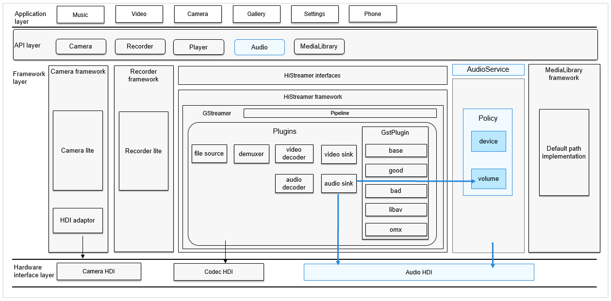

# Audio<a name="EN-US_TOPIC_0000001146901937"></a>

-   [Introduction](#section119mcpsimp)
    -   [Basic Concepts](#section122mcpsimp)

-   [Directory Structure](#section179mcpsimp)
-   [Usage Guidelines](#section112738505318)
-   [Repositories Involved](#section340mcpsimp)

## Introduction<a name="section119mcpsimp"></a>

The  **audio\_standard**  repository supports the development of audio services. You can use this module to manage audio volume.

**Figure  1**  Position in the subsystem architecture<a name="fig483116248288"></a>  




### Basic Concepts<a name="section122mcpsimp"></a>

-   **Sampling**

Sampling is a process to obtain discrete-time signals by extracting samples from analog signals in a continuous time domain at a specific interval.

-   **Sampling rate**

Sampling rate is the number of samples extracted from a continuous signal per second to form a discrete signal. It is measured in Hz. Generally, human hearing range is from 20 Hz to 20 kHz. Common audio sampling rates include 8 kHz, 11.025 kHz, 22.05 kHz, 16 kHz, 37.8 kHz, 44.1 kHz, 48 kHz, 96 kHz, and 192 kHz.

-   **Channel**

Channels refer to different spatial positions where independent audio signals are recorded or played. The number of channels is the number of audio sources used during audio recording, or the number of speakers used for audio playback.

-   **Audio frame**

Audio data is in stream form. For the convenience of audio algorithm processing and transmission, it is generally agreed that a data amount in a unit of 2.5 to 60 milliseconds is one audio frame. This unit is called sampling time, and its length is specific to codecs and the application requirements.

-   **PCM**

Pulse code modulation \(PCM\) is a method used to digitally represent sampled analog signals. It converts continuous-time analog signals into discrete-time digital signal samples.

## Directory Structure<a name="section179mcpsimp"></a>

The structure of the repository directory is as follows:

```
/foundation/multimedia/audio_standard  # Audio code
├── frameworks                         # Framework code
│   ├── innerkitsimpl                  # Internal interfaces implementation
│   └── kitsimpl                       # External interfaces implementation
├── interfaces                         # Interfaces code
│   ├── innerkits                      # Internal interfaces
│   └── kits                           # External interfaces
├── sa_profile                         # Service configuration profile
├── services                           # Service code
├── LICENSE                            # License file
└── ohos.build                         # Build file
```

## Usage Guidelines<a name="section112738505318"></a>

1.  Obtain an  **AudioManager**  instance.

    ```
    const audioManager = audio.getAudioManager();
    ```

2.  Obtain the audio stream volume.

    ```
    audioManager.getVolume(audio.AudioVolumeType.MEDIA, (err, value) => {
       if (err) {
    	   console.error(`failed to get volume ${err.message}`);
    	   return;
       }
       console.log(`Media getVolume successful callback`);
    });
    ```

3.  Set the audio stream volume.

    ```
    audioManager.setVolume(audio.AudioVolumeType.MEDIA, 30, (err)=>{
       if (err) {
    	   console.error(`failed to set volume ${err.message}`);
    	   return;
       }
       console.log(`Media setVolume successful callback`);
    })
    ```


## Repositories Involved<a name="section340mcpsimp"></a>

multimedia\_audio\_standard

