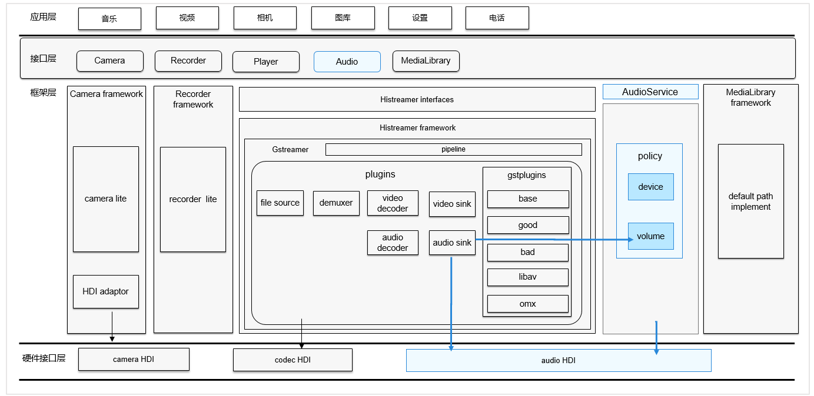

# 音频组件<a name="ZH-CN_TOPIC_0000001146901937"></a>

-   [简介](#section119mcpsimp)
    -   [基本概念](#section122mcpsimp)

-   [目录](#section179mcpsimp)
-   [使用说明](#section112738505318)
-   [相关仓](#section340mcpsimp)

## 简介<a name="section119mcpsimp"></a>

音频组件支持音频业务的开发，提供音量管理。

**图 1**  音频组件架构图<a name="fig483116248288"></a>  




### 基本概念<a name="section122mcpsimp"></a>

-   **采样**

采样是指将连续时域上的模拟信号按照一定的时间间隔采样，获取到离散时域上离散信号的过程。

-   **采样率**

采样率为每秒从连续信号中提取并组成离散信号的采样次数，单位用赫兹（Hz）来表示。通常人耳能听到频率范围大约在20Hz～20kHz之间的声音。常用的音频采样频率有：8kHz、11.025kHz、22.05kHz、16kHz、37.8kHz、44.1kHz、48kHz、96kHz、192kHz等。

-   **声道**

声道是指声音在录制或播放时在不同空间位置采集或回放的相互独立的音频信号，所以声道数也就是声音录制时的音源数量或回放时相应的扬声器数量。

-   **音频帧**

音频数据是流式的，本身没有明确的一帧帧的概念，在实际的应用中，为了音频算法处理/传输的方便，一般约定俗成取2.5ms\~60ms为单位的数据量为一帧音频。这个时间被称之为“采样时间”，其长度没有特别的标准，它是根据编解码器和具体应用的需求来决定的。

-   **PCM**

PCM（Pulse Code Modulation），即脉冲编码调制，是一种将模拟信号数字化的方法，是将时间连续、取值连续的模拟信号转换成时间离散、抽样值离散的数字信号的过程。

## 目录<a name="section179mcpsimp"></a>

仓目录结构如下：

```
/foundation/multimedia/audio_standard  # 音频组件业务代码
├── frameworks                         # 框架代码
│   ├── innerkitsimpl                  # 内部接口实现
│   └── kitsimpl                       # 外部接口实现
├── interfaces                         # 接口代码
│   ├── innerkits                      # 内部接口
│   └── kits                           # 外部接口
├── sa_profile                         # 服务配置文件
├── services                           # 服务代码
├── LICENSE                            # 证书文件
└── ohos.build                         # 编译文件
```

## 使用说明<a name="section112738505318"></a>

1.  获取音频控制器。

    ```
    const audioManager = audio.getAudioManager();
    ```

2.  获取媒体流的音量。

    ```
    audioManager.getVolume(audio.AudioVolumeType.MEDIA, (err, value) => {
       if (err) {
    	   console.error(`failed to get volume ${err.message}`);
    	   return;
       }
       console.log(`Media getVolume successful callback`);
    });
    ```

3.  改变媒体流的音量。

    ```
    audioManager.setVolume(audio.AudioVolumeType.MEDIA, 30, (err)=>{
       if (err) {
    	   console.error(`failed to set volume ${err.message}`);
    	   return;
       }
       console.log(`Media setVolume successful callback`);
    })
    ```


## 相关仓<a name="section340mcpsimp"></a>

媒体子系统仓：multimedia\_audio\_standard

